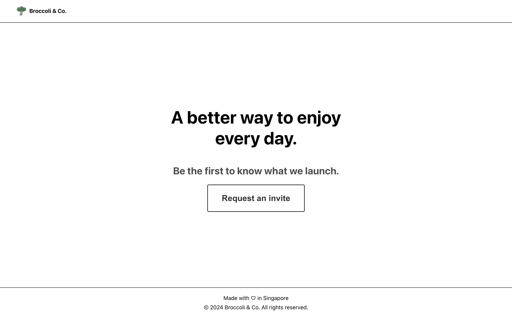
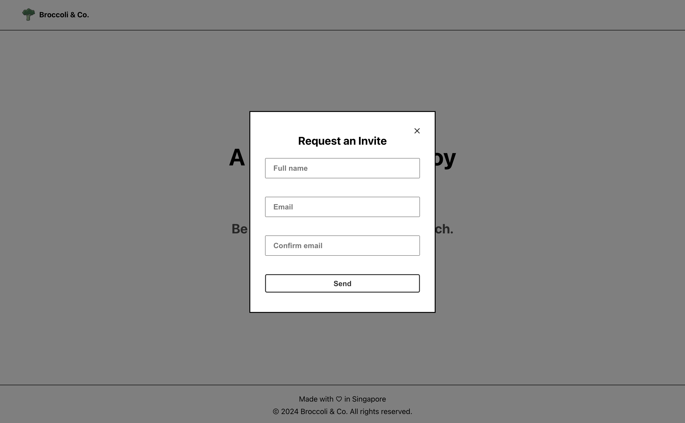

# Broccoli & Co. Web App

This project was bootstrapped with [Create React App](https://github.com/facebook/create-react-app).

This app is a homepage to allow users to enter their name and email to receive email invitations.





## Getting Started

### Running the app locally

Run the following code in your terminal.

```
yarn start
```

This runs the app in the development mode. Open [http://localhost:3000](http://localhost:3000) to view it in the browser.

#### Project Directory

The files are located in the `/src` folder, which mainly contain `/pages` folder to hold the directory of each of the existing pages. All logics related to the page should be contained in each page folder.

`/assets`, `/components`, and `/theme` contains the common things that might be used in each of the pages.

### Building the app

Run the following code in your terminal.

```
yarn build
```

Builds the app for production to the `/build` folder. It correctly bundles React in production mode and optimizes the build for the best performance.

#### Deployment

This app can be deployed to github pages. To do so, run the following command:

```
yarn deploy
```

This will deploy the app into [the web page](https://pocoyopin.github.io/broccoli-co/).

### Unit tests

Run the following command to run the unit tests

```
yarn test
```

This launches the test runner in the interactive watch mode. The tests are located in the `/tests` folder. All the common components that might be rarely changed should store the snapshot. Each of the unit tests for a page should be collated under one single file.
